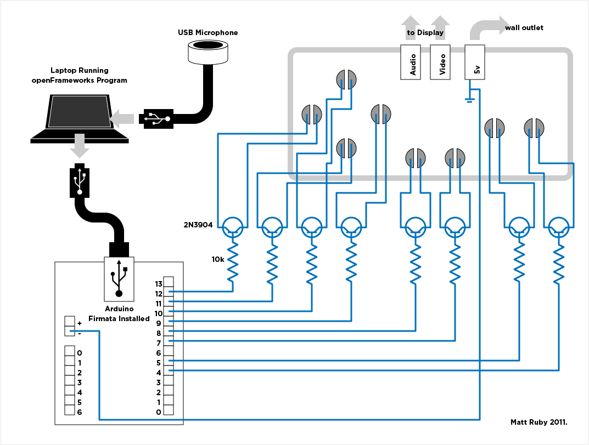

## Excitebike ##

Excitebike is an interactive artwork which examines the relationship between people and digital systems. The work is an attempt to push the boundaries of comfortable interaction by challenging the user with foreign and difficult controls. The video game Excitebike from the original Nintendo Entertainment System has been subverted by hacking into the game controller and building an interface to control the existing game software. A motorcycle helmet embedded with a microphone and feeds into software which analyzes volume and frequency provide the interface between the user and the onscreen action. This interface provokes foreign and expressive interactions in hopes of inspiring viewers to question their role as participant. The helmet allows the user a semi-private place to make noise and express themselves, while simultaneously making them the center of attention. The system encourages and rewards the user for their excitement and enthusiasm.

